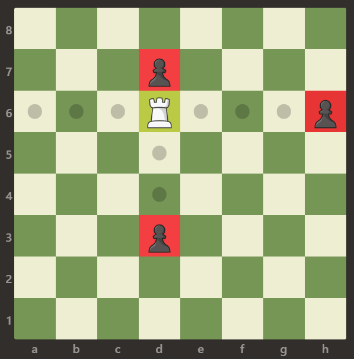

# 999.可以被一步捕获的棋子数
题目链接：[传送门](https://leetcode-cn.com/problems/available-captures-for-rook/)

## 题目描述：
在一个 $8 \times 8$ 的棋盘上，有一个白色的车（`Rook`），用字符`'R'`表示。棋盘上还可能存在空方块，白色的象（`Bishop`）以及黑色的卒（`pawn`），分别用字符 `'.'`，`'B'` 和 `'p'` 表示。不难看出，大写字符表示的是白棋，小写字符表示的是黑棋。

车按国际象棋中的规则移动。东，西，南，北四个基本方向任选其一，然后一直向选定的方向移动，直到满足下列四个条件之一：
- 棋手选择主动停下来。
- 棋子因到达棋盘的边缘而停下。
- 棋子移动到某一方格来捕获位于该方格上敌方（黑色）的卒，停在该方格内。
- 车不能进入/越过已经放有其他友方棋子（白色的象）的方格，停在友方棋子前。

你现在可以控制车移动一次，请你统计有多少敌方的卒处于你的捕获范围内（即，可以被一步捕获的棋子数）。

**提示**：

- `board.length == board[i].length == 8`
- `board[i][j]` 可以是 `'R'`，`'.'`，`'B'` 或 `'p'`
- 只有一个格子上存在 `board[i][j] == 'R'`

**示例1**：



- 输入：

```
[[".",".",".",".",".",".",".","."],
[".",".",".","p",".",".",".","."],
[".",".",".","R",".",".",".","p"],
[".",".",".",".",".",".",".","."],
[".",".",".",".",".",".",".","."],
[".",".",".","p",".",".",".","."],
[".",".",".",".",".",".",".","."],
[".",".",".",".",".",".",".","."]]
```

- 输出：`3`
- 解释：在本例中，车能够捕获所有的卒。

**示例2**：


- 输入：

```
[[".",".",".",".",".",".",".","."],
[".","p","p","p","p","p",".","."],
[".","p","p","B","p","p",".","."],
[".","p","B","R","B","p",".","."],
[".","p","p","B","p","p",".","."],
[".","p","p","p","p","p",".","."],
[".",".",".",".",".",".",".","."],
[".",".",".",".",".",".",".","."]]
```

- 输出：`0`
- 解释：象阻止了车捕获任何卒。

**示例3**：


- 输入：

```
[[".",".",".",".",".",".",".","."],
[".",".",".","p",".",".",".","."],
[".",".",".","p",".",".",".","."],
["p","p",".","R",".","p","B","."],
[".",".",".",".",".",".",".","."],
[".",".",".","B",".",".",".","."],
[".",".",".","p",".",".",".","."],
[".",".",".",".",".",".",".","."]]
```

- 输出：`3`
- 解释：车可以捕获位置`b5`，`d6`和`f5`的卒。

## 解决方案：
- 时间复杂度：$O(n)$
- 空间复杂度：$O(1)$
- 思路：直接从白色车的四个方向走一遍，遇到黑卒或棋盘边缘或白象停止即可！

## AC代码：
```java
class Solution {
	private int m, n, ans;
	public int numRookCaptures(char[][] board) {
		if (board == null || (m = board.length) == 0 || (n = board[0].length) == 0)
			return 0;
		ans = 0;
		boolean flag = true;
		for (int i = 0; i < m && flag; i++)
			for (int j = 0; j < n && flag; j++)
				if (board[i][j] == 'R') {
					board[i][j] = 'B';
					dfs(i, j, -1, 0, board);
					dfs(i, j, 0, 1, board);
					dfs(i, j, 1, 0, board);
					dfs(i, j, 0, -1, board);
					flag = false;
				}
		return ans;
	}
	private void dfs(int x, int y, int dx, int dy, char[][] board) {
		int nx = x + dx;
		int ny = y + dy;
		if (check(nx, ny) && board[nx][ny] != 'B') {
			if (board[nx][ny] == 'p') {
				ans++; // 敌方卒个数加1
				return;
			}
			board[nx][ny] = 'B';
			dfs(nx, ny, dx, dy, board);
		}
	}
	private boolean check(int x, int y) {
		return x >= 0 && x < m && y >= 0 && y < n;
	}
}
```