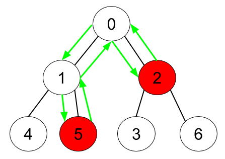

# 1443.收集树上所有苹果的最少时间
题目链接：[传送门](https://leetcode-cn.com/problems/minimum-time-to-collect-all-apples-in-a-tree/)

## 题目描述：
给你一棵有`n`个节点的无向树，节点编号为`0`到`n-1`，它们中有一些节点有苹果。通过树上的一条边，需要花费`1`秒钟。你从**节点0**出发，请你返回最少需要多少秒，可以收集到所有苹果，并回到节点`0`。

无向树的边由`edges`给出，其中`edges[i] = [`$from_i, to_i$`]`，表示有一条边连接 $ from_i $ 和 $ to_i $ 。除此以外，还有一个布尔数组`hasApple`，其中`hasApple[i] = true`代表节点`i`有一个苹果，否则，节点`i`没有苹果。

**提示**：

- $ 1 \leq n \leq 10^5 $
- `edges.length == n-1`
- `edges[i].length == 2`
- $ 0 \leq from_i, to_i \leq n-1 $
- $ from_i < to_i $
- `hasApple.length == n`

**示例1**：


- 输入：`n = 7`, `edges = [[0,1],[0,2],[1,4],[1,5],[2,3],[2,6]]`, `hasApple = [false,false,true,false,true,true,false]`
- 输出：`8` 
- 解释：上图展示了给定的树，其中红色节点表示有苹果。一个能收集到所有苹果的最优方案由绿色箭头表示。



- 输入：`n = 7`, `edges = [[0,1],[0,2],[1,4],[1,5],[2,3],[2,6]]`, `hasApple = [false,false,true,false,false,true,false]`
- 输出：`6`
- 解释：上图展示了给定的树，其中红色节点表示有苹果。一个能收集到所有苹果的最优方案由绿色箭头表示。

## 解决方案：
- 时间复杂度：$O(n)$
- 空间复杂度：$O(n)$
- 思路：树形dp。定义：`dp[i]`表示从`i`节点开始向下收集完苹果后返回到`i`节点花费的最少时间，易得状态转移方程为：$ dp[i] = \sum_{j \in i_{son}} (dp[j] + 2) $，其中必须满足以`j`为起点的子树中含有苹果。

## AC代码：
```java
class Solution {
	public int minTime(int n, int[][] edges, List<Boolean> hasApple) {
		int len;
		if (edges == null || (len = edges.length) == 0)
			return 0;
		List<Integer>[] graph = new ArrayList[n];
		int[] dp = new int[n];
		for (int i = 0; i < n; i++)
			graph[i] = new ArrayList<Integer>();
		for (int i = 0; i < len; i++) { // 建双向边
			graph[edges[i][0]].add(edges[i][1]);
			graph[edges[i][1]].add(edges[i][0]);
		}
		dfs(0, -1, graph, hasApple, dp);
		return dp[0]; // 返回到根节点所花费的最少时间
	}
	private void dfs(int u, int fa, List<Integer>[] graph, List<Boolean> hasApple, int[] dp) {
		for (int i = 0, siz = graph[u].size(), v; i < siz; i++) {
			v = graph[u].get(i);
			if (v == fa) // 避免陷入死循环
				continue;
			dfs(v, u, graph, hasApple, dp); // 先递归到叶子节点，回溯时再查看当前节点的子节点是否包含苹果
			if (hasApple.get(v)) { // 子树有苹果才进行状态转移
				dp[u] += 2 + dp[v];
				hasApple.set(u, true); // 设置 v 的父节点 u 的子树含有苹果
			}
		}
	}
}
```